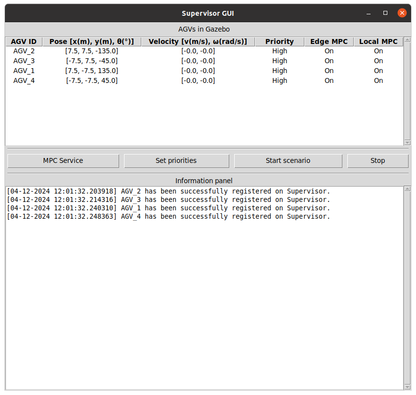

# 2tierMPC-igngazebo

As simulações foram validadas com o sistema operacional, ferramentas e pacotes indicados a seguir:

* Ubuntu 20.04 LTS arm64
* ROS 2 Foxy Fitzroy
* Gazebo Citadel
* Python 3.8.10
* CasADi v3.6.7

## Instalação das ferramentas no Ubuntu

A instalação das ferramentas é feita em dois computadores/máquinas virtuais, uma representando o lado da borda e a outra o lado local, ou apenas em um computador/máquina virtual.

1. Instalar o ROS 2 seguindo as instruções deste [link](https://docs.ros.org/en/foxy/Installation/Ubuntu-Install-Debians.html) (incluindo o ros-dev-tools).
2. Para que os comandos do ROS 2 se tornem acessíveis, execute no terminal:
```
echo "source /opt/ros/foxy/setup.bash" >> ~/.bashrc
```
É necessário executar o comando acima uma única vez após a instalação do ROS 2. 
Veja mais detalhes neste 
[link](https://docs.ros.org/en/foxy/Tutorials/Beginner-CLI-Tools/Configuring-ROS2-Environment.html).

Se estiver utilizando computadores/máquinas virtuais diferentes para o lado da borda e o lado local, você pode testar a comunicação do ROS 2 executando um nó que "fala" em um lado e um nó que "escuta" do outro lado, executando:

````
ros2 run demo_nodes_cpp talker # o que fala
ros2 run demo_nodes_py listener # o que escuta
````
3. Instalar o CasADi para Python seguindo as instruções deste [link](https://web.casadi.org/get/).
4. Apenas no computador/máquina virtual do lado local, instalar o Gazebo seguindo as instruções deste [link](https://gazebosim.org/docs/citadel/install_ubuntu/).
5. Apenas no computador/máquina virtual do lado local, instalar os pacotes de integração do Gazebo e ROS 2 Foxy Fitzroy executando os comandos:
```
sudo apt-get install ros-foxy-ros-ign-gazebo
sudo apt-get install ros-foxy-ros-ign-bridge
```

## Preparação dos pacotes do lado da borda

1. Abra um terminal no diretório /edge disponibilizado e execute o comando:
```
colcon build
```
2. Existem três pacotes na borda: "edge_tier_pkg", "edge_launch" e "interfaces_pkg". 
Esses pacotes serão construídos após a execução do colcon. 
Caso queira modificar os códigos dos dois primeiros pacotes sem a necessidade de executar 
novamente o colcon, ainda no diretório /edge, faça:
```
colcon build --packages-select edge_tier_pkg --symlink-install
colcon build --packages-select edge_launch --symlink-install
```


3. Para que os pacotes construídos também se tornem acessíveis, execute o comando abaixo, 
colocando o caminho até o diretório /edge:
````
echo "source /caminho_ate_o_diretorio/edge/install/setup.bash" >> ~/.bashrc
````

## Preparação dos pacotes do lado local

1. Nas simulações realizadas para os resultados da tese, os pacotes da borda e do lado local foram executados em dois computadores diferentes, conectados em rede cabeada. Para a preparação dos pacotes no lado local, a mesma sequência de comandos deve ser executada, portanto, no mesmo ou em outro computador, a partir do diretório /local:
````
colcon build
colcon build --packages-select local_tier_pkg --symlink-install
colcon build --packages-select local_launch --symlink-install
echo "source /caminho_ate_o_diretorio/local/install/setup.bash" >> ~/.bashrc
````

Lembrando que a execução do colcon com o symlink-install não é obrigatória, é apenas para facilitar no caso da necessidade de editar o código e executá-lo novamente sem precisar reconstruir o pacote.

## Inicialização dos nós

1. A demonstração apresentada neste documento será baseada no Cenário 1, 
sendo o mesmo procedimento para os demais. No computador que representa a borda, faça:
````
ros2 launch edge_launch edge.scn_1.launch.py
````
Esse launch file irá executar quatro nós de MPC para planejamento da trajetória, dado os quatro 
AGVs do cenário, além do nó do Supervisor e sua interface gráfica.

2. No lado local são executados dois launch files. O primeiro executará o Gazebo e lançará os 
componentes que compõem o cenário, como AGVs e obstáculos. O segundo executará os quatro nós 
do MPC de rastreamento da trajetória. Em terminais diferentes, execute cada um dos comandos a seguir:
````
ros2 launch local_launch scn_1.launch.py
ros2 launch local_launch local_1_all.launch.py
````
Após a abertura do Gazebo, clique no botão laranja no canto inferior esquerdo (play) para que o Gazebo
inicie os tópicos do ROS e esteja preparado para a simulação. Neste momento o Supervisor detecta e 
registra os quatro AGVs da simulação.

Se preferir, instale o Terminator e tenha vários terminais em uma única janela. Detalhes da 
instalação estão neste [link](https://www.geeksforgeeks.org/terminator-a-linux-terminal-emulator/).

Nas simulações para os resultados da tese foi utilizada uma máquina virtual para cada AGV no 
computador do lado local, de modo a representar o computador embarcado no AGV de uma aplicação real. 
No caso do Cenário 1, um total de cinco máquinas virtuais foram utilizadas, sendo uma de cada AGV e 
uma para o Gazebo. Nessa situação foi criado um launch file para cada máquina virtual, o qual 
executava um nó de MPC para o respectivo AGV.

## Interface gráfica do Supervisor



1. Ao carregar todos os nós do cenário, os dados dos AGVs devem ser vistos na interface gráfica e o 
cenário está pronto para ser iniciado.
2. No botão 'MPC Service' é possível que o serviço de MPC seja chamado individualmente para cada AGV 
do cenário. Na janela que abrirá ao clicar no botão, é possível informar os dados de posição para 
onde o AGV deve ir e chamar o serviço.
3. No botão 'Set priorities' é possível ajustar a prioridade de cada AGV, podendo ser alta ('High'), 
média ('Medium') ou baixa ('Low'). Neste trabalho a prioridade apenas determina a velocidade linear 
máxima do AGV. Em projetos futuros outras funções podem ser adicionadas no Supervisor, como por 
exemplo, em uma situação de conflito, o AGV com maior prioridade possa ter preferência na passagem.
4. Ao clicar no botão 'Start scenario' o Supervisor irá iniciar os procedimentos que estão previstos 
para o cenário em questão. No cenário 1 o Supervisor irá chamar o serviço de MPC para cada AGV, 
de modo que os veículos troquem de posição na diagonal. Nos cenários 2 e 3, a posição dos AGVs é 
controlada pelo Supervisor para atender a aplicação prevista para o cenário. Nesse caso, os nós de 
MPC serão chamados diversas vezes até que a simulação seja interrompida.
5. Ao clicar no botão 'Stop' os AGVs estacionam onde estiverem naquele instante.

## Inicialização dos outros cenários

1. Inicialmente é preciso alterar o código do arquivo supervisor.py do pacote edge_tier_pkg. 
No arquivo altere a classe que será herdada pela classe SupervisorNode, de acordo com o cenário. 
Nestas classes estão os algoritmos de supervisão para cada cenário. Para o cenário 2, por exemplo, 
a classe SupervisorNode herda as classes Node e Scenario2, conforme a seguir:
````
class SupervisorNode(Node, Scenario2):
````
Obs.: Caso os pacotes não tenham sido construídos com o symlinkinstall, será necessário 
construí-los novamente para que a alteração no código tenha efeito.

2. Para inicializar os nós dos outros cenários, apenas altere o número do comando do launch file. 
Por exemplo, para o cenário 2, os comandos da borda e do lado local são os seguintes:

* Borda
````
ros2 launch edge_launch edge.scn_2.launch.py
````
* Local
````
ros2 launch local_launch scn_2.launch.py
ros2 launch local_launch local_2_all.launch.py
````

## Salvando dados da simulação

1. Se desejar salvar os dados da simulação, nos launch files da borda e do lado local altere o 
valor lógico da variável save_sim_data para True.
2. Na variável sim_name dos dois launch files coloque um nome que irá compor os nomes dos arquivos 
a serem salvos e que identifique a simulação.
3. Agora abra os arquivos mpc_node.py e mpc_tracking_node.py dos pacotes edge_tier_pkg e 
local_tier_pkg, respectivamente, e coloque na variável self.path o caminho onde os arquivos dos dados 
da simulação serão salvos.
4. No lado da borda serão salvos um arquivo de texto com o tempo de processamento do MPC em cada 
iteração e um arquivo texto com as métricas de uso do processador e memória. No lado local, além 
desses dois arquivos, serão salvos os arquivos de texto com os dados de trajetória percorrida pelo 
AGV e os sinais de controle enviados ao Gazebo.

## Parâmetros

1. Vários parâmetros são passados aos nós através dos launch files. Na borda, as variáveis que 
definem alguns desses parâmetros, são:

* d_safe: distância de segurança entre os AGVs
* d_safe_obs: distância de segurança entre os AGVs e obstáculos fixos
* high_vel, medium_vel e low_vel: velocidades lineares em m/s para cada prioridade
* obstacles: quantidade dos obstáculos mais próximos a ser considerada pelo MPC na prevenção de 
colisões
* limit_n: quantidade dos AGVs mais próximos a ser considerada pelo MPC na prevenção de colisões

Os dois últimos parâmetros podem ser utilizados para a diminuição do intervalo de tempo das iterações 
do MPC na borda. Quanto menor o número de obstáculos e AGVs a serem considerados, menor o intervalo 
de tempo da iteração. Quando o limit_n recebe o valor 0, todos os AGVs serão considerados e é o 
caso que demandará mais uso de CPU. O ajuste do limit_n, principalmente, é útil em simulações em 
que a quantidade de AGVs poderá colocar a CPU em seu limite máximo e tornar a simulação lenta. 
Nas simulações para os resultados da tese, o limit_n foi ajustado para diferente de 0 nos 
Cenários 2 e 4. Estes cenários têm mais AGVs e ainda trafegam uns próximos aos outros, dificultando 
a obtenção da solução do MPC quanto à prevenção de colisões.

2. Alguns parâmetros ajustados nos launch files do lado local são também as prioridades e as 
velocidades. Em especial no Cenário 4, defina a quantidade de AGVs em números pares a serem lançados 
na simulação.  Isso é feito através da variável n nos launch files local_4_all.launch.py e 
scn_4.launch.py. Nas simulações para os resultados da tese foram utilizados 12 AGVs.

## Documentos relacionados

* [Tese](http://dspace.sti.ufcg.edu.br:8080/jspui/handle/riufcg/30896)
* [Artigo Elsevier IoT](https://www.sciencedirect.com/science/article/abs/pii/S2542660522001470)
* [Artigo Congresso Brasileiro de Automática 2022](https://www.sba.org.br/cba2022/wp-content/uploads/artigos_cba2022/paper_9287.pdf)
